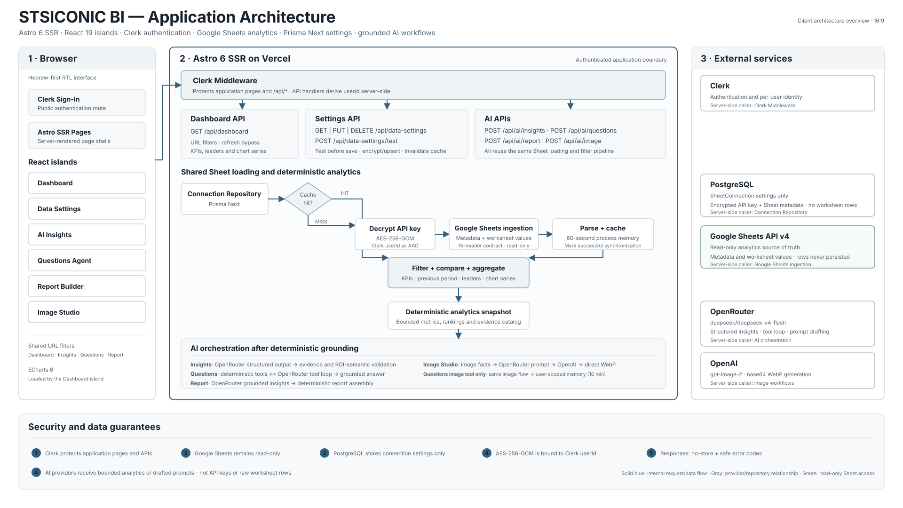
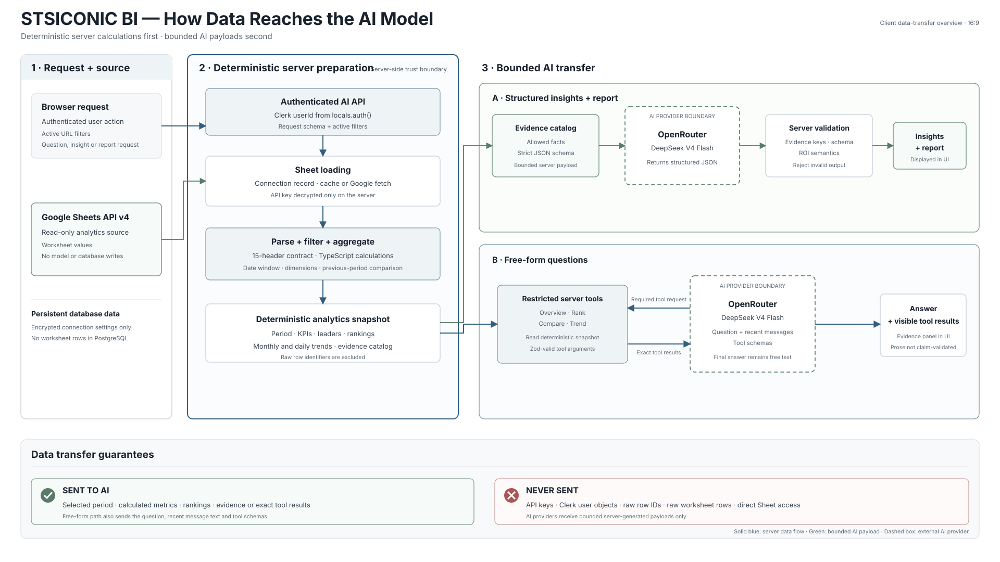

# STSICONIC Business Intelligence

STSICONIC is a Hebrew-first, right-to-left business intelligence application for marketing and sales data. It runs as an Astro 6 SSR application on Vercel, uses React 19 islands for interactive screens, protects the application with Clerk, reads analytics from Google Sheets, stores per-user connection settings in PostgreSQL through Prisma Next, and uses ECharts, OpenRouter, and OpenAI for charts and grounded AI workflows.

## Product capabilities

- Ten management KPIs with previous-period comparisons, leaders, and responsive ECharts visualizations.
- Combined date, campaign, channel, salesperson, region, and product/service filters persisted in the URL.
- Read-only Google Sheets synchronization, including a manual cache bypass, skipped-row counts, and sanitized Hebrew error states.
- Per-user Sheet overrides with masked API keys encrypted using AES-256-GCM and the Clerk user ID as authenticated additional data.
- Structured AI insights, a tool-driven questions agent, a management report with CSV/PDF export, and explicit image generation.
- Hebrew RTL layouts designed for desktop and 390 px mobile screens.

## Local quickstart

Use Node 24.x and Bun 1.3 or newer. If the external services and credentials already exist:

~~~bash
git clone https://github.com/ultimaisolutions/project.git
cd project

nvm install 24
nvm use 24
bun install --frozen-lockfile
~~~

Create `.env.local` from the [environment-variable reference](#environment-variables), or pull the development environment if you are authorized and the checkout is linked to Vercel:

~~~bash
npx vercel env pull .env.local --environment=development --yes
~~~

Then initialize the database and start Astro:

~~~bash
bun run migrate
bun run db:verify
bun run dev
~~~

Open [http://localhost:4321](http://localhost:4321). Never commit `.env.local` or paste credentials into the README, issues, logs, or client-side code.

## Running in a new environment

A completely new local or hosted environment needs the following setup:

1. Install Node 24.x and Bun 1.3 or newer, clone the repository, and run `bun install --frozen-lockfile`.
2. Create a Clerk application. Enable the desired sign-in methods and allow `http://localhost:4321/sign-in/sso-callback` for local OAuth. Use separate Clerk production credentials for a public deployment.
3. Provision an empty PostgreSQL database and copy its connection URL into `DATABASE_URL`.
4. Enable Google Sheets API v4, create a server-side API key that can read the target native Google Sheet, and ensure the worksheet follows the [15-column contract](#google-sheet-contract).
5. Create an OpenRouter key for insights, reports, questions, and image-prompt drafting. Create an OpenAI key only if image generation is required.
6. Create `.env.local` with the variable names below. Use placeholders while documenting configuration; put real values only in the local file or the deployment provider's secret store.
7. Run `bun run migrate` and `bun run db:verify` against the new database.
8. Run `bun run dev`, sign in, connect or restore a Sheet source, and verify the dashboard before testing AI features.

For Vercel, add the same variables to the target environment, set `PUBLIC_SITE_URL` to the canonical HTTPS URL, apply the committed database migrations, and deploy:

~~~bash
npx vercel link --project stsiconic-project --yes
npx vercel env add <VARIABLE_NAME> production --sensitive
bun run migrate
npx vercel deploy --prod --yes
~~~

Development credentials are not production credentials. Keep production Clerk keys, database credentials, provider keys, and the encryption key in Vercel's secret store.

## Environment variables

The table documents names and responsibilities only; it contains no real keys or credentials.

| Variable | Requirement | Purpose |
| --- | --- | --- |
| `PUBLIC_CLERK_PUBLISHABLE_KEY` | Required | Clerk browser publishable key. This is the only Clerk key intended for browser use. |
| `CLERK_SECRET_KEY` | Required | Server-only Clerk key used to authenticate requests. |
| `DATABASE_URL` | Required | PostgreSQL connection URL used by Prisma Next. |
| `DB_STRING` | Legacy fallback | Local alias accepted when `DATABASE_URL` is not present; new environments should use `DATABASE_URL`. |
| `SETTINGS_ENCRYPTION_KEY` | Required for per-user settings | Base64-encoded 32-byte key used to encrypt saved Google API keys. |
| `GOOGLE_SHEETS_API` | Optional shared-default group | Server-only Google Sheets API key. Must be configured together with `SHEET_ID` and `SHEET_NAME`. |
| `SHEET_ID` | Optional shared-default group | Native Google Sheet ID used when a user has no saved override. |
| `SHEET_NAME` | Optional shared-default group | Worksheet name, normally `נתונים`. |
| `OPENROUTER_API_KEY` | Required for text AI | Server-only key for structured insights, reports, questions, and prompt drafting. |
| `OPENAI_API_KEY` | Required for image AI | Server-only key for `gpt-image-2` generation. |
| `PUBLIC_SITE_URL` | Required when hosted | Canonical application URL for auth redirects and OpenRouter attribution. Localhost requests stay local. |
| `CLERK_SIGN_IN_URL` | Recommended | Clerk sign-in route; use `/sign-in`. |
| `CLERK_SIGN_IN_FALLBACK_REDIRECT_URL` | Recommended | Post-sign-in route; use `/dashboard`. |
| `CLERK_SIGN_UP_FALLBACK_REDIRECT_URL` | Recommended | Post-sign-up route; use `/dashboard`. |
| `CLERK_TESTING_TOKEN` | E2E only | Optional Clerk testing token for authenticated Playwright flows. |
| `VERCEL_PROJECT_PRODUCTION_URL` | Vercel-managed fallback | Used automatically as the hosted URL when `PUBLIC_SITE_URL` is absent. Do not set it manually on Vercel. |

A safe local template looks like this; every angle-bracket value must be replaced privately:

~~~dotenv
PUBLIC_CLERK_PUBLISHABLE_KEY=<clerk-publishable-key>
CLERK_SECRET_KEY=<clerk-secret-key>
DATABASE_URL=<postgresql-connection-url>
SETTINGS_ENCRYPTION_KEY=<base64-encoded-32-byte-key>

OPENROUTER_API_KEY=<openrouter-key>
OPENAI_API_KEY=<openai-key>

GOOGLE_SHEETS_API=<google-sheets-api-key>
SHEET_ID=<native-google-sheet-id>
SHEET_NAME=נתונים

PUBLIC_SITE_URL=http://localhost:4321
CLERK_SIGN_IN_URL=/sign-in
CLERK_SIGN_IN_FALLBACK_REDIRECT_URL=/dashboard
CLERK_SIGN_UP_FALLBACK_REDIRECT_URL=/dashboard
~~~

Generate a new encryption value with `openssl rand -base64 32`. The three shared Sheet variables are all-or-nothing. If they are omitted, each user must connect a Sheet through Data Settings.

## Application architecture

Astro renders authenticated page shells and API routes on the server, while focused React islands provide the dashboard, data settings, AI insights, questions, report, and image interfaces. Clerk middleware protects every application page and `/api/*` route and API handlers derive the user ID from `locals.auth()` rather than trusting a request parameter.

Google Sheets is the read-only analytics source of truth. PostgreSQL stores only each user's encrypted Sheet connection configuration; worksheet rows are parsed in memory and cached per process for 60 seconds. One deterministic TypeScript pipeline applies filters, calculates comparisons, KPIs, leaders, chart series, rankings, and evidence before any AI workflow runs.

## API overview

All API routes require Clerk authentication. JSON endpoints enforce same-origin JSON requests where applicable, return `no-store` responses, expose sanitized symbolic error codes, and never return plaintext or encrypted API keys.

| Method and route | Purpose |
| --- | --- |
| `GET /api/dashboard` | Loads the active Sheet, applies URL filters, and returns KPIs, leaders, chart series, sync metadata, warnings, and skipped-row counts. `?refresh=1` bypasses the in-memory cache. |
| `GET /api/data-settings` | Returns the current secret-free Sheet connection state and masked-key metadata. |
| `PUT /api/data-settings` | Tests, encrypts, and saves a per-user Sheet connection, or restores server defaults. |
| `DELETE /api/data-settings` | Disconnects the current user's Sheet source. |
| `POST /api/data-settings/test` | Validates a proposed Google API key, Sheet ID, worksheet, and required headers before saving. |
| `POST /api/ai/insights` | Builds grounded structured insights for the active filters. Clients can request NDJSON progress events with `Accept: application/x-ndjson`; ordinary callers receive JSON. |
| `POST /api/ai/questions` | Runs the multi-turn Hebrew BI agent against restricted deterministic tools and returns the answer with visible tool evidence. |
| `POST /api/ai/report` | Combines the filtered snapshot, grounded insights, and deterministic report assembly. It supports the same negotiated NDJSON progress transport. |
| `POST /api/ai/image` | Builds bounded image facts, drafts a prompt through OpenRouter, and generates a WebP image with OpenAI. |

## AI data flow

The browser sends an authenticated action and the active URL filters. The server loads the user's connection, reads the Sheet, validates and parses it, applies filters, and calculates a deterministic analytics snapshot. Only then does it send a bounded payload to OpenRouter: calculated metrics and an allowed evidence catalog for structured insights, or exact results from restricted server tools for free-form questions. API keys, Clerk user objects, raw row IDs, raw worksheet rows, and direct Sheet access are never sent to the model.

### How answers stay grounded in Sheet data

1. **Deterministic calculations come first.** KPIs, comparisons, rankings, and trends are calculated in TypeScript from the filtered Sheet rows; the model does not calculate them from raw rows.
2. **Structured insights have an allowlist.** The model receives a bounded evidence catalog and a strict JSON Schema whose evidence keys are generated from the live snapshot.
3. **The server validates the result.** Unknown evidence keys, schema violations, unsupported numeric claims, and contradictory ROI semantics are rejected. A structural failure may be retried once; invalid output is not displayed as a valid insight.
4. **Free-form questions must use a tool.** The first agent step requires a restricted server tool such as overview, rank, compare, or trend. Tool arguments are validated with Zod, and the exact tool results are returned to the UI as visible evidence.
5. **The provider has no independent data access.** OpenRouter receives only server-generated facts, the user's question and recent message text when needed, plus tool schemas/results.

These controls make structured insights evidence-bound and make question answers auditable. The final free-form sentence is still model-generated rather than independently claim-validated, so the visible tool evidence is the authoritative reference if wording and data ever disagree.

## Google Sheet contract

The source must be a native Google Sheet readable by the configured API key. Runtime access is read-only: parsing, normalization, filtering, and aggregation happen in memory and are never written back to Google Sheets.

The first row must contain these exact headers; additional columns are allowed:

1. `מזהה שורה`
2. `תאריך`
3. `שם קמפיין`
4. `ערוץ פרסום`
5. `תקציב`
6. `סכום שהוצא בפועל`
7. `חשיפות`
8. `קליקים`
9. `לידים`
10. `פגישות`
11. `עסקאות`
12. `הכנסות`
13. `איש מכירות`
14. `אזור`
15. `מוצר או שירות`

Dates use `DD/MM/YYYY`. Duplicate or missing row IDs and invalid dates are skipped. Blank numeric cells remain `null`, numeric zero remains `0`, and blank dimensions become `לא צוין`.

## Database lifecycle

The committed Prisma Next contract is in `src/prisma/contract.*` and matching additive migrations are under `migrations/`.

~~~bash
bun run contract:emit
bun run migration:plan
bun run migrate
bun run db:verify
~~~

Regenerate and commit the contract and migration artifacts together for every schema change. Keep every Prisma Next package pinned to the same version.

## Verification

Run the core checks before handing off a change:

~~~bash
bun run check
bun test
bun run build
~~~

Run Playwright when authentication, routing, responsive UI, or browser behavior changes:

~~~bash
bun run test:e2e
~~~

Authenticated E2E flows may require `CLERK_TESTING_TOKEN` and Clerk development credentials. Database contract changes also require `bun run db:verify`.
