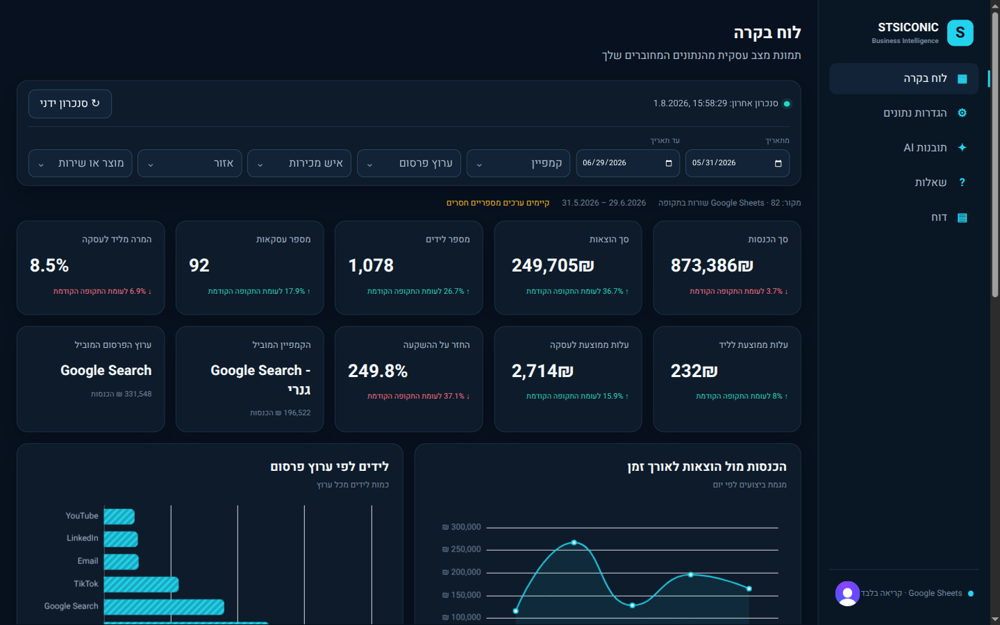
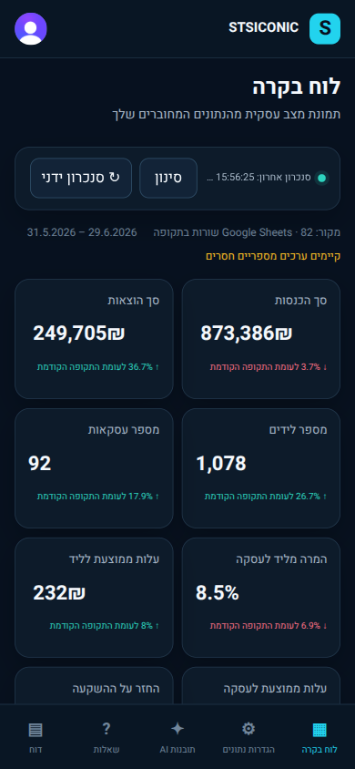

# STSICONIC Business Intelligence

Hebrew-first, right-to-left marketing and sales dashboard built from the requirements in [`docs/משימת בית - STSICONIC.pdf`](docs/משימת%20בית%20-%20STSICONIC.pdf). The application runs as Astro 6 SSR on Vercel with React 19 islands, Clerk authentication, Google Sheets v4 as the read-only analytics source, ECharts 6, the official OpenRouter TypeScript SDK plus the Vercel AI SDK for tool loops, OpenAI image generation, and Prisma Next on PostgreSQL.

## Product capabilities

- Zero-configuration shared Google Sheets defaults from server environment variables, with optional per-user overrides whose keys are masked and encrypted with AES-256-GCM bound to the Clerk user ID.
- Ten management KPIs: spend, revenue, leads, deals, lead-to-deal conversion, cost per lead, cost per deal, ROI, leading campaign, and leading channel.
- Revenue/spend trend, leads by channel, conversion by campaign, revenue by salesperson, product performance, funnel, campaign, channel, and region charts.
- Combined date, campaign, channel, salesperson, region, and product/service filters with URL persistence and clear-all.
- Manual cache-bypassing synchronization, last-sync metadata, duplicate-ID rejection, skipped-row counts, and actionable Hebrew failure states.
- Structured AI management analysis with exactly three central insights, trends, anomalies, exceptional performers, recommendations, investigation points, and visible deterministic evidence.
- Multi-turn Hebrew BI agent with mandatory tools for KPI overviews, rankings, monthly comparison, daily trends, and explicit image generation.
- Dedicated management report with period, KPIs, summary, insights, anomalies, recommendations, charts, UTF-8 CSV download, and print-to-PDF styling.
- Data-grounded `gpt-image-2` creation for report covers, visual summaries, top campaigns, top products/services, and central achievements, including prompt disclosure and download.

## Data and security architecture

1. Clerk middleware protects every application page and `/api/*` endpoint. APIs derive the user ID from `locals.auth()`; clients never submit an identity.
2. PostgreSQL stores only `SheetConnection` configuration. Worksheet rows and generated images are never persisted to the database.
3. Google API keys are encrypted with AES-256-GCM. The Clerk user ID is authenticated additional data, so another user cannot decrypt the ciphertext.
4. Google Sheets v4 reads metadata and worksheet values in read-only requests. There are no Sheet writes, CSV fallbacks, or hard-coded analytics results.
5. A short-lived in-memory cache is scoped by user and connection revision. Manual synchronization bypasses it and then updates `lastSyncAt`.
6. Dashboard, AI, questions, reports, and images share one deterministic filter and aggregation pipeline.
7. OpenRouter receives a bounded, server-generated analytics snapshot—not API keys, Clerk objects, row IDs, or direct Sheet access. OpenAI receives the drafted visual prompt and a one-way hash of the Clerk user ID.
8. API responses use `no-store`, never return encrypted/plaintext credentials, and expose only sanitized error codes.

Structured management insights use `@openrouter/sdk` with strict JSON Schema output, provider capability enforcement, explicit no-reasoning mode, a bounded notable-evidence catalog, and server-side Zod/evidence/ROI-sign validation. The multi-step questions agent and image-prompt drafter use the Vercel AI SDK's tool and object APIs with the same fixed OpenRouter model.

### KPI formulas

| KPI | Formula |
| --- | --- |
| Spend | Sum of `סכום שהוצא בפועל` |
| Revenue | Sum of `הכנסות` |
| Leads | Sum of `לידים` |
| Deals | Sum of `עסקאות` |
| Lead-to-deal conversion | Deals ÷ leads |
| Cost per lead | Spend ÷ leads |
| Cost per deal | Spend ÷ deals |
| ROI | (Revenue − spend) ÷ spend |
| Leading campaign | Campaign with the highest filtered revenue |
| Leading channel | Channel with the highest filtered revenue |

Ratios with a zero denominator return “no value,” not infinity. KPI deltas compare the selected inclusive period with the immediately preceding period of equal length. The default dashboard period is the latest 30 days available in the Sheet.

## Google Sheet contract

The source must be a native Google Sheet readable by the configured Google API key. Uploaded `.xlsx` files must first be saved as Google Sheets; the API reports a dedicated conversion error otherwise. The assignment workbook was converted with Google Sheets' **Save as Google Sheets** action into this [clean native source Sheet](https://docs.google.com/spreadsheets/d/1qPXnaU3uOdP8k45Hvv1m5aa-6aFM2uZbQYvHhQM80zQ/edit#gid=1870745923). The original workbook remains [available separately](https://docs.google.com/spreadsheets/d/1ABQbrFHWkLppb2U60IgsXnr6A2n0A6ns/edit#gid=1870745923).

No cell, column, worksheet, or business value was changed during conversion. The clean native Sheet is the immutable final ground truth. A separate QA copy is used only for the changed/new-row synchronization acceptance test, and the application is reconnected to the clean Sheet afterward. Runtime processing is read-only: it parses dates and numerics in memory, maps blank dimensions to `לא צוין`, preserves blank numeric cells as `null`, and skips invalid dates plus duplicate or missing row IDs. It never writes those transformations back to Google Sheets.

The first row must include these exact headers; additional columns are allowed:

1. `מזהה שורה`
2. `תאריך`
3. `שם קמפיין`
4. `ערוץ פרסום`
5. `תקציב`
6. `סכום שהוצא בפועל`
7. `חשיפות`
8. `קליקים`
9. `לידים`
10. `פגישות`
11. `עסקאות`
12. `הכנסות`
13. `איש מכירות`
14. `אזור`
15. `מוצר או שירות`

Dates use `DD/MM/YYYY`. Duplicate/missing row IDs and invalid dates are skipped. Blank numeric cells remain `null`, numeric zero remains `0`, and blank dimensions become `לא צוין`.

## Local development - Quickstart

Requirements: Node 24.x, Bun 1.3 or newer, a Clerk development instance, PostgreSQL/Neon, Google Sheets API access, OpenRouter, and OpenAI.

```sh
nvm use
bun install
cp .env.example .env.local
bun run migrate
bun run dev
```
If you're linked to the vercel project, use `vercel env pull` instead of `cp .env.example .env.local` - that will create an .env.local file and pull the env variables
straight from vercel.

Clerk should enable Google and/or email-password authentication, self-service sign-up, and `http://localhost:4321/sign-in/sso-callback` for local OAuth callbacks.

### Environment variables

| Variable | Purpose |
| --- | --- |
| `PUBLIC_CLERK_PUBLISHABLE_KEY` | Clerk browser publishable key |
| `CLERK_SECRET_KEY` | Clerk server key |
| `DATABASE_URL` | PostgreSQL connection URL (`DB_STRING` is accepted locally as a legacy alias) |
| `SETTINGS_ENCRYPTION_KEY` | Base64-encoded 32-byte key for Sheet API-key encryption |
| `OPENROUTER_API_KEY` | Server-only OpenRouter key for `deepseek/deepseek-v4-flash` |
| `OPENAI_API_KEY` | Server-only OpenAI key for `gpt-image-2` |
| `GOOGLE_SHEETS_API` | Shared server-only Google Sheets API key used automatically for users without an override |
| `SHEET_ID` | Shared native Google Sheet ID used automatically for users without an override |
| `SHEET_NAME` | Shared worksheet name, normally `נתונים` |
| `PUBLIC_SITE_URL` | Canonical hosted application URL used for auth redirects and OpenRouter attribution |
| `CLERK_SIGN_IN_URL` | Clerk sign-in route (`/sign-in`) |
| `CLERK_SIGN_IN_FALLBACK_REDIRECT_URL` | Post-sign-in route (`/dashboard`) |
| `CLERK_SIGN_UP_FALLBACK_REDIRECT_URL` | Post-sign-up route (`/dashboard`) |

The three shared Sheet variables are all-or-nothing: when the complete set is present, a newly authenticated user can open the dashboard immediately without visiting data settings. A saved per-user override takes precedence; an explicit disconnect suppresses the shared fallback until the user reconnects or restores the system default.

Set `PUBLIC_SITE_URL` to the canonical HTTPS deployment URL in hosted environments. Local requests deliberately keep their localhost origin, while hosted Clerk callbacks use the canonical URL and reject a mistakenly configured localhost origin.

Generate the encryption value with `openssl rand -base64 32`. Never commit `.env.local` or provider/database credentials.

## Database lifecycle

The committed Prisma Next contract is in `src/prisma/contract.*`; the matching additive migration is under `migrations/`. Vercel uses the per-request Prisma Next serverless facade and disposes every database runtime after the repository operation.

```sh
bun run contract:emit
bun run migration:plan
bun run migrate
bun run db:verify
```

Regenerate and commit the contract and migration artifacts together for every schema change. All Prisma Next packages remain pinned to the same version.

## Verification

```sh
bun run check
bun test
bun run test:e2e
bun run build
bun run db:verify
```

Automated coverage validates the Sheet contract, duplicates and blank-vs-zero handling, KPI formulas, all six filters, every required chart, AI evidence schemas, rankings, reports/CSV, image-asset user isolation, encryption isolation, SSR safety, unauthenticated redirects, callback routing, and desktop/mobile sign-in overflow. Authenticated acceptance is performed manually through Chrome at desktop and 390 px because a green suite alone does not prove UI behavior.

### Dashboard screenshots

| Desktop | Mobile (390 px) |
| --- | --- |
|  |  |

## Vercel deployment

The repository is linked to the `stsiconic-project` Vercel project. Use the installed Vercel CLI or the package-runner form shown below. Configure development and preview values without the Sensitive flag, then pull them explicitly:

```sh
npx vercel env pull .env.local --environment=development --yes
npx vercel env pull /tmp/stsiconic-preview.env --environment=preview --yes
```

Both pulls were verified on 1 August 2026: they reconstruct the same 13 application variables, while Preview also includes Vercel-provided deployment metadata. `vercel env ls` reports the Development and Preview entries as ordinary pullable `Encrypted` variables, not `Sensitive` variables; the team-wide sensitive-variable policy is disabled. Production secrets remain separate and are added with the `--sensitive` flag.

The Astro SSR function has a 300-second `maxDuration` because report analysis and `gpt-image-2` generation wait on external AI services. This matches Vercel Fluid compute's current default ceiling while the OpenRouter and OpenAI clients retain shorter request-specific timeouts.

At production handoff, link the project, add every variable from the table above with production-specific values, apply the migration to the production database, deploy, and repeat the Chrome acceptance pass on the public URL:

```sh
npx vercel link --project stsiconic-project --yes
npx vercel env add <VARIABLE_NAME> production --sensitive
bun run migrate
npx vercel deploy --prod --yes
```

Development Clerk keys are not production credentials. Production Clerk publishable/secret keys must come from the provisioned production instance and remain Sensitive.

## Handoff checklist

- Live production URL: added after the production deployment passes acceptance.
- Source code: [github.com/ultimaisolutions/project](https://github.com/ultimaisolutions/project).
- Source Sheet: the immutable native Google Sheet linked above; confirm its final Viewer access before public deployment.
- Demo access: supply a dedicated Clerk demo account separately; credentials are never committed.
- Screen recording: record and link the final authenticated desktop/mobile walkthrough after live acceptance.
- Detailed implementation and browser checklist: [`docs/implementation-plan.md`](docs/implementation-plan.md).
